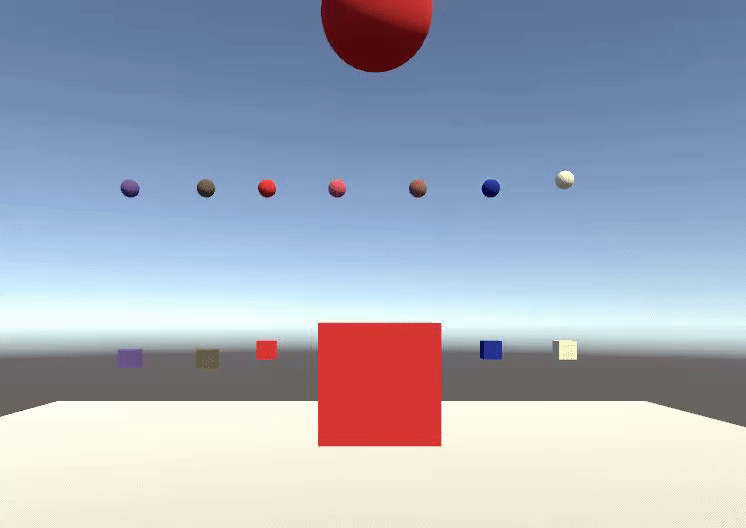
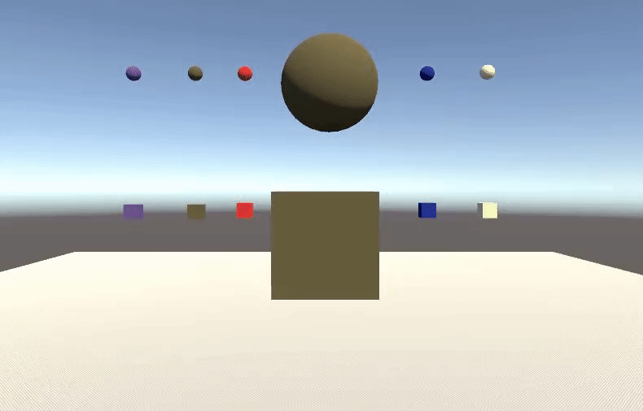

# Práctica 2.
### 1. Crear una escena simple sobre la que probar diferentes configuraciones de objetos físicos en Unity. La escena debe tener un plano a modo de suelo, una esfera y un cubo.

#### a) Ninguno de los objetos será físico.


Como los objetos no tienen físicas no se mueven.


#### b) La esfera tiene físicas, el cubo no.


Gracias al Rigidbody la esfera tiene gravedad y por ende cae.


#### c) La esfera y el cubo tienen físicas.


#### d) La esfera y el cubo son físicos y la esfera tiene 10 veces la masa del cubo.


Cuando un objeto impacta con otro de mucha mayor masa este rueda.


#### e) La esfera tiene físicas y el cubo es de tipo IsTrigger.


Ahora el objeto sea traspasable.


#### f) La esfera tiene físicas, el cubo es de tipo IsTrigger y tiene físicas.


Ahora como el cubo también tiene física y por lo tanto gravedad, traspasa el terreno y cae al infinito


#### g) La esfera y el cubo son físicos y la esfera tiene 10 veces la masa del cubo, se impide la rotación del cubo sobre el plano XZ.


Si no bloqueamos los ejes se ve como rota.


Bloqueando los ejes que no se quieren rotar.

---

### 2. Sobre la escena que has trabajado ubica un cubo que represente un personaje que vas a mover. Se debe implementar un script que haga de CharacterController. Cuando el jugador pulse las teclas de flecha (o aswd) el jugador se moverá en la dirección que estos ejes indican.

#### a) Crear un script para el personaje que lo desplace por la pantalla, sin aplicar simulación física.

``` c#
void Update() {
    float translacion = Input.GetAxis("Vertical") * MoveSpeed;
    float rotacion = Input.GetAxis("Horizontal") * MoveSpeed;
    transformObject.position += new Vector3(rotacion, 0.0f, translacion) * Time.deltaTime;
    }
```
#### b) Agregar un campo público que permita graduar la velocidad del movimiento desde el inspector de objetos.

``` c#
public class controlador_jugador : MonoBehaviour {
  [Header("Jugador")]
  [Tooltip("Velocidad")]
  public float MoveSpeed = 2.0f;
  void Update() {
    float translacion = Input.GetAxis("Vertical") * MoveSpeed;
    float rotacion = Input.GetAxis("Horizontal") * MoveSpeed;
    transformObject.position += new Vector3(rotacion, 0.0f, translacion) * MoveSpeed * Time.deltaTime;
    }
}
```
#### c) Estar a la escucha de si el usuario ha utilizado los ejes virtuales. Elegir cuáles se va a permitir utilizar: flechas, awsd.
``` c#
public class controlador_jugador : MonoBehaviour {
  [Header("Jugador")]
  [Tooltip("Velocidad")]
  public float MoveSpeed = 2.0f;
  void Update() {
    if (Input.GetKey(KeyCode.W)) {
      transform.Translate(Vector3.forward * MoveSpeed * Time.deltaTime);
    }
    if (Input.GetKey(KeyCode.S)) {
      transform.Rotate(Vector3.up * 180 * Time.deltaTime);
      transform.Translate(Vector3.back * MoveSpeed * Time.deltaTime);
    }
    if (Input.GetKey(KeyCode.A)) {
      transform.Rotate(Vector3.up * -90 * Time.deltaTime);
      transform.Translate(Vector3.left * MoveSpeed * Time.deltaTime);
    }
    if (Input.GetKey(KeyCode.D)) {
      transform.Rotate(Vector3.up * 90 * Time.deltaTime);
      transform.Translate(Vector3.right * MoveSpeed * Time.deltaTime);
    }
    }
}
```


### 3. Sobre la escena que has trabajado programa los scripts necesarios para las siguientes acciones:

#### a) Se deben incluir varios cilindros sobre la escena. Cada vez que el objeto jugador colisione con alguno de ellos, deben aumentar su tamaño y el jugador aumentar puntuación.
``` c#
  void OnCollisionEnter(Collision collision) {
    if (collision.gameObject.tag == "Tipo C") {
      Debug.Log("Chocaste con un cilindro tipo C ");
      transform.localScale += new Vector3(escala, escala, escala);
      puntos++;
      Debug.Log("Puntos:\n" + puntos);
      GameObject.FindWithTag("Puntos").GetComponent<TMPro.TextMeshProUGUI>().text = "Puntos:\n" + puntos;
    }
  }
```
#### b) Agregar cilindros de tipo A, en los que además, si el jugador pulsa la barra espaciadora lo mueve hacia fuera de él. 
``` c#
public class controlador_jugador : MonoBehaviour {
  void Update() {
    if (Input.GetKeyDown(KeyCode.Space) && chocando) {
        Debug.Log("Space");
        Vector3 move = new Vector3(objetoChocado.transform.position.x - rb.position.x, 0, objetoChocado.transform.position.z - rb.position.z);
        objetoChocado.gameObject.transform.position += move;
        chocando = false;
      }
  }
  void OnCollisionEnter(Collision collision) {
    if (collision.gameObject.tag == "Tipo A") {
      chocando = true;
      objetoChocado = collision.gameObject;
    } else {
      chocando = false;
    }
  }
}
```
#### c) Se deben incluir cilindros que se alejen del jugador cuando esté próximo.
``` c#
public class controlador_cilindro : MonoBehaviour {
  [Header("Pilar")]
  [Tooltip("Distancia Tipo B")]
  public float distancia = 20.0f;
  void Update() {
    if (gameObject.tag == "Tipo B") {
      if (Vector3.Distance(GameObject.FindWithTag("Jugador").transform.position, transform.position) < distancia) {
        Debug.Log("Cerca");
        transform.position = Vector3.MoveTowards(transform.position, new Vector3(GameObject.FindWithTag("Jugador").transform.position.x - 10 * Time.deltaTime, transform.position.y, GameObject.FindWithTag("Jugador").transform.position.z - 10), -10 * Time.deltaTime);
      }
    }
  }
}
```
#### d) Ubicar un tercer objeto que sea capaz de detectar colisiones y que se mueva con las teclas: I, L, J, M
``` c#
public class controlador_jugador2 : MonoBehaviour {
  [Header("Jugador 2")]
  [Tooltip("Velocidad")]
  public float MoveSpeed = 2.0f;
  void Update() {
    if (Input.GetKey(KeyCode.I)) {
      transform.Translate(Vector3.forward * MoveSpeed * Time.deltaTime);
    }
    if (Input.GetKey(KeyCode.K)) {
      transform.Rotate(Vector3.up * 180 * Time.deltaTime);
      transform.Translate(Vector3.back * MoveSpeed * Time.deltaTime);
    }
    if (Input.GetKey(KeyCode.J)) {
      transform.Rotate(Vector3.up * -90 * Time.deltaTime);
      transform.Translate(Vector3.left * MoveSpeed * Time.deltaTime);
    }
    if (Input.GetKey(KeyCode.L)) {
      transform.Rotate(Vector3.up * 90 * Time.deltaTime);
      transform.Translate(Vector3.right * MoveSpeed * Time.deltaTime);
    }
  }
}
```
#### e) Debes ubicar cubos que que aumentan de tamaño cuando se le acerca una esfera y que disminuye cuando se le acerca el jugador.
``` c#
public class cubos_dimension : MonoBehaviour {
  [Header("Cubitos")]
  [Tooltip("Factor de escala")]
  public float escala = 0.001f;
  void Update() {
    if (Vector3.Distance(GameObject.FindWithTag("Jugador").transform.position, transform.position) < 30) {
      transform.localScale += new Vector3(escala * Time.deltaTime, escala * Time.deltaTime, escala * Time.deltaTime);
    }
    if (Vector3.Distance(GameObject.FindWithTag("Esfera").transform.position, transform.position) < 30) {
      transform.localScale += new Vector3(-escala * Time.deltaTime, -escala * Time.deltaTime, -escala * Time.deltaTime);
    }

  }
}
```
